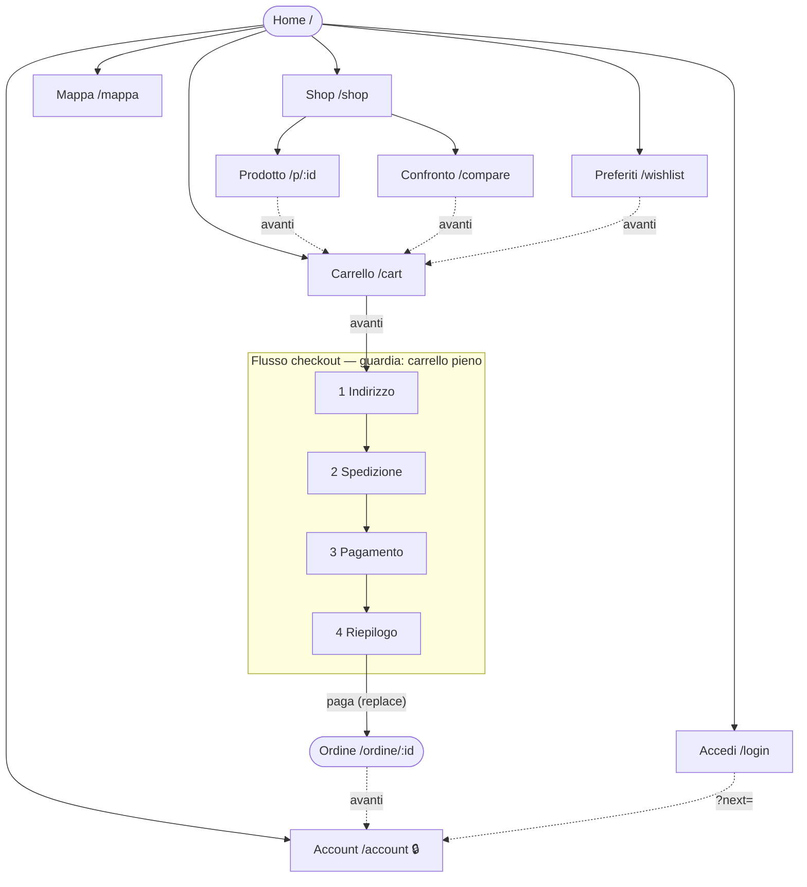

# Mappa di navigazione

La mappa vive in **`src/nav/map.ts`** ed è l'unica fonte di verità:
- le rotte (`App.tsx`) sono generate da lì. TypeScript dà errore se un nodo non ha una pagina o se una pagina non ha un nodo;
- la barra **Indietro · percorso · Avanti** (`src/nav/PageNav.tsx`) e le **guardie** leggono la stessa mappa;
- la pagina **`/#/mappa`** la mostra visivamente.

Il modello unisce tre strumenti classici dell'architettura dell'informazione:

1. **Albero (sitemap):** ogni pagina ha un `parent`. Da qui vengono il percorso (breadcrumb) e il "sali di un livello".
2. **Flussi (user flow):** percorsi lineari a passi ordinati, oggi il checkout. Dentro un flusso Indietro e Avanti seguono i passi, non l'albero.
3. **Tre direzioni:** indietro/su, avanti (una sola uscita principale per pagina) e di lato (pagine dello stesso livello).

## Regole

| Direzione | Regola |
|---|---|
| **Indietro** | In un flusso: passo precedente (dal passo 1 → Carrello). Da un prodotto: i risultati da cui venivi, con gli stessi filtri. Da una ricerca filtrata: tutto lo shop. Altrimenti: il `parent`. |
| **Avanti** | Una sola uscita principale per pagina (`forward`), mostrata solo quando serve: "Carrello (n)" se hai articoli, "Checkout" dal carrello, "I miei ordini" dopo l'ordine. Nei passi del checkout si avanza col bottone del passo, che prima valida i dati. |
| **Di lato** | `sideways`: preferiti, confronto, carrello. |
| **Guardie** | `cart`: checkout senza articoli → Carrello. `auth`: account senza accesso → `/login?next=…`, poi ritorno lì. `guest`: login da connesso → Account. |
| **Flusso** | Si torna indietro liberamente ma non si salta avanti: aprire `/checkout/riepilogo` senza indirizzo porta a `/checkout/indirizzo`. I dati inseriti restano anche con il tasto Indietro del browser. |
| **Nodo terminale** | L'ordine si apre con `replace`: Indietro non riapre mai il pagamento. |
| **Fuori mappa** | 404 con link a Home e Mappa. |

## Aggiungere una pagina

1. Aggiungi il nodo in `NODES` (`id`, `path`, `title`, `parent`, `forward`/`sideways`, `guard`, `purpose`).
2. Aggiungi il componente in `PAGES` in `App.tsx`: TypeScript segnala l'errore finché non c'è.
3. Se è un percorso a passi, aggiungilo a `FLOWS`.

Barra, percorso, guardie e `/mappa` si aggiornano da soli.

## Verifica

`scripts/nav-check.cjs` (Playwright) controlla nel browser 17 regole: guardie, ritorno ai risultati con filtri, passi del flusso con dati conservati, niente ritorno al pagamento, login con ritorno, 404.
